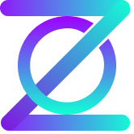
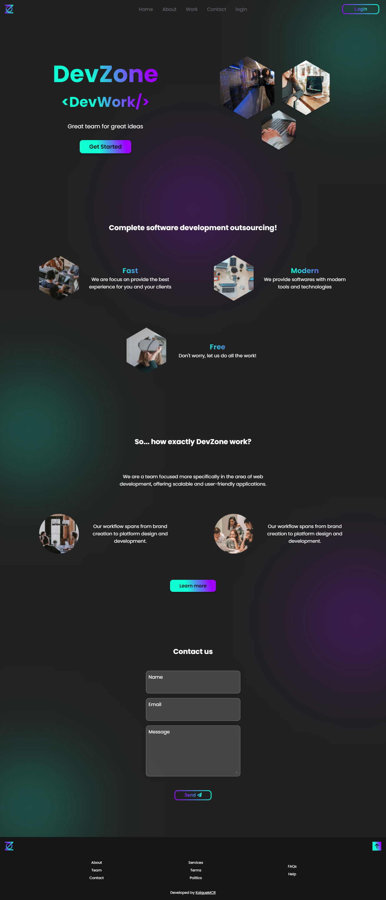

# DevZone webpage

 

  
  <h2>DevZone - We got it!</h2>

 

🚀 DevZone is a home page of a plataform of a Development team services. This project was made focused on improve coding and design skills, first of all i designed on figma then coded it self. Also, the project was also made to be a lib consumption training for me (scrollreveal in that case).

## Screenshot

Click on the image above to see in production 👆

## 🔖 Layout

You can view the project layout through [this link](https://www.figma.com/file/A00KGfw3ScXeapKGUzJEui/DevZone?node-id=0%3A1). 
You need an account on [Figma](https://figma.com) to access it.

## 👾 Technologies

- Semantic HTML
- CSS (Sass)
- Javascript

## 💪 Contributing

1. Fork the repo on GitHub
2. Clone the project to your own machine
3. Commit changes to your own branch
4. Push your work back up to your fork
5. Submit a Pull request so that we can review your changes

## 📄 License

[MIT](https://choosealicense.com/licenses/mit/)
